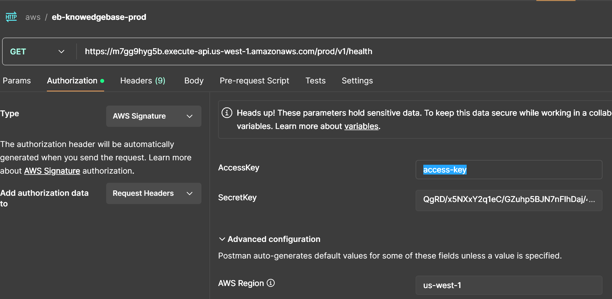

# CANOPY KNOWLEDGE BASE

ONLINE USE
## DEV:
base url: https://egpvzxxbib.execute-api.us-west-1.amazonaws.com/dev

Swagger documentation
https://egpvzxxbib.execute-api.us-west-1.amazonaws.com/dev/docs

health test: https://egpvzxxbib.execute-api.us-west-1.amazonaws.com/dev/v1/health
- should return the below on successful connection
    {
    "pinecone_status": "OK",
    "llm_status": "OK"
    }

e.g. to Chat with Canopy, using the LLM and context engine (from with your code)
https://egpvzxxbib.execute-api.us-west-1.amazonaws.com/dev/v1/chat/completions

## PROD: 
#### AWS KEYS REQUIRED for prod requests 
base url: https://m7gg9hyg5b.execute-api.us-west-1.amazonaws.com/prod

health test: https://m7gg9hyg5b.execute-api.us-west-1.amazonaws.com/prod/v1/health
- should return the below on successful connection
    {
    "pinecone_status": "OK",
    "llm_status": "OK"
    }

e.g. to Chat with Canopy, using the LLM and context engine (from with your code)
https://m7gg9hyg5b.execute-api.us-west-1.amazonaws.com/prod/v1/chat/completions